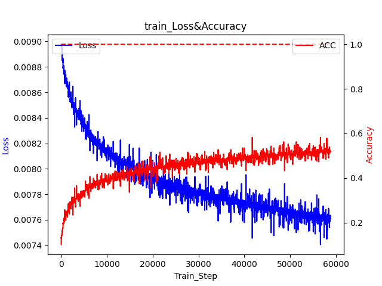

# VisionTransformer[ICLR 2020] on CIFAR10

## Overview

This repository provides a simple implementation of the Vision Transformer (ViT) model on the CIFAR10 dataset. The VisionTransformer is a powerful architecture that applies the transformer model to image classification tasks. This implementation is inspired by the repository [JiaxingSong718/VisionTransformer](https://github.com/JiaxingSong718/VisionTransformer) and includes extensive Chinese comments to facilitate understanding.

## Key Features

- Implementation of the Vision Transformer model for image classification.
- Training and testing on the CIFAR10 dataset.
- Extensive Chinese comments for better code comprehension.
- Visualization of training and testing loss and accuracy.

## Getting Started

### Prerequisites

Before you begin, ensure you have met the following requirements:

- Python 3.x
- PyTorch 1.x
- CUDA (if using GPU)
- NumPy
- Matplotlib
- torchvision

You can install the required Python packages using pip:

```bash
pip install torch torchvision numpy matplotlib
```


### Usage

To train the model, run the following command:

```bash
python VisionTransformer_CIFAR10.py
```

This will start the training process with default parameters. You can adjust the parameters by modifying the `args` in the `VisionTransformer_CIFAR10.py` script.

## Code Structure

Here's an overview of the code structure and key components:

```
VisionTransformer-CIFAR10/
│
├── VisionTransformer_CIFAR10.py  # Main script for training and testing the Vision Transformer model.
├── loss_acc_test.png           # Plot of test loss and accuracy.
├── loss_acc_train.png          # Plot of training loss and accuracy.
└── README.md                   # This file.
```

## Visualization

Below are the plots illustrating the training and testing loss and accuracy:

### Training Loss and Accuracy



### Testing Loss and Accuracy


These plots show the progression of the model's performance over epochs, with the x-axis representing the training steps or epochs, and the y-axis representing the loss and accuracy.

## Acknowledgements

This implementation is inspired by the work in the repository [JiaxingSong718/VisionTransformer](https://github.com/JiaxingSong718/VisionTransformer). I would like to express our gratitude for their contribution to the field.

## License

This project is licensed under the MIT License - see the [LICENSE](LICENSE) file for details.
